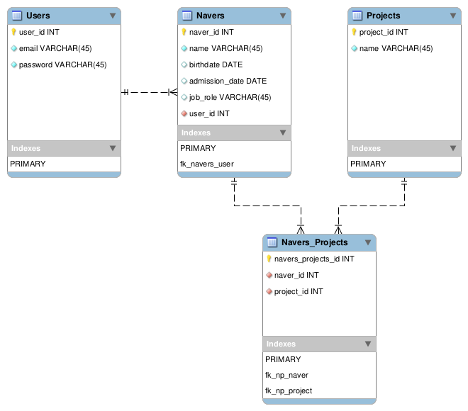

# Navedex API

Desafio para a vaga de Backend Júnior da empresa Nave.rs.

## Estruturação do Banco de Dados

 

## Dificuldades
  - Entender inicialmente como ficaria a estruturação das tabelas do banco. Depois de um tempo pensando um pouco e raciocinando melhor, ficou mais claro como devia ficar.

   

  - Criar a relação entre Naver's e Project's, bem como como realizar o cadastro de um Naver com nenhum ou + Projects, e vice-versa. Pesquisando a respeito, a melhor escolha para mim seria utilizar a anotação `@ManyToMany` do TypeORM, onde o trabalho de cadastro dessas entidades ficou mais fácil.

   

  - Criar a lógica por trás da filtragem (por `name`, `birthdate` e `admission_date`) de Naver's. No final, para resolver isso, criei métodos para buscar os Naver's cada qual com sua propriedade específica:
    - `findAllByName`
    - `findAllByAdmissionDate`
    - `findAllByJobRole`

    Dessa forma, a manipulação e verificação desses dados se tornou mais fácil.

